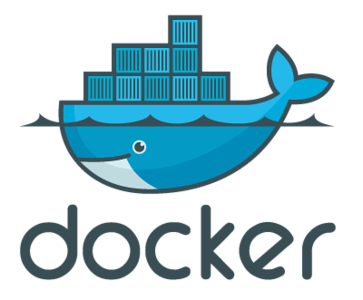
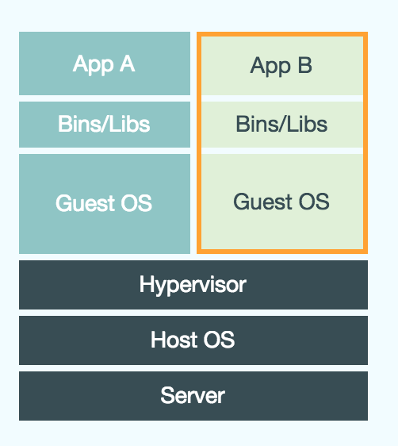
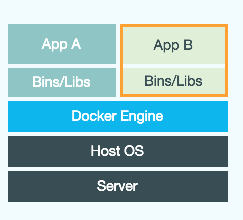
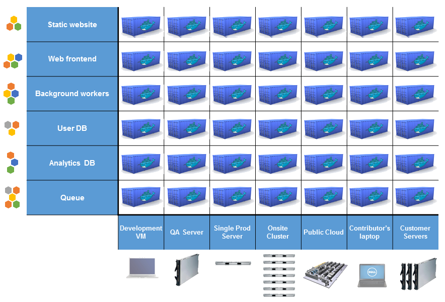
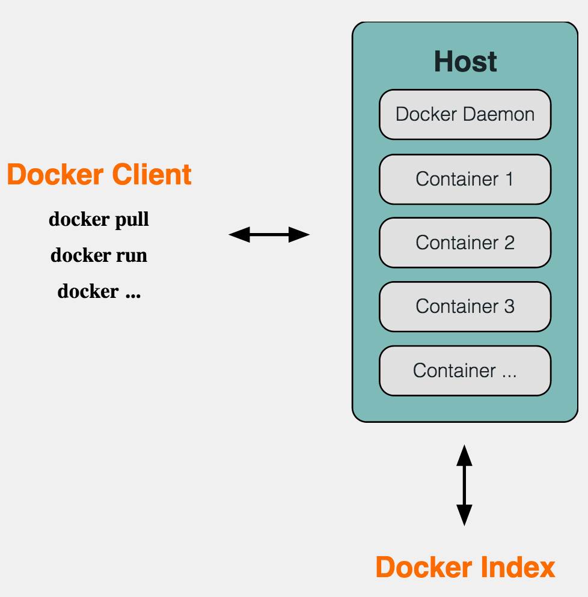
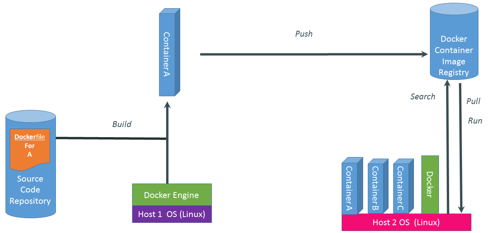

# Docker的介绍
Docker可以说是Go语言里面的killer app, 正是随着Docker的流行，越来越多的云计算公司采用Go语言作为他们的主要开发语言，例如corsOS、Google Cloud Platform等公司。

## Docker和虚拟机的区别

可能今年大家都听说过Docker，那么这条大鲸鱼到底是干嘛的呢？Docker其实就是虚拟化的应用，那么他和虚拟机有什么区别呢？请看下面这个图：

我们常见的虚拟机有VirtualBox，VMware等，比较厂家的云计算厂商，如AWS，阿里云，Ucloud等的云主机系统也都是建立在虚拟机之上的，那么他们这些云主机是怎么运行的呢？基本上都是如下图所示的架构

我们可以看到传统的虚拟云主机要发布一个应用，除了包含了你的应用之外，还包含了很庞大体积的

但是Docker的改进之处就是变得非常的轻量级别：

## Docker的目标
简答的一句话就是：编译一次到处运行，请看下面这个比较形象的图

## Docker的架构

docker主要分成三个主要部件：

- Docker daemon
- Docker Client
- Docker registry

## Docker的技术基础

- Namespace
- Control Group
- UnionFS
- LXC

## Docker的操作流程

